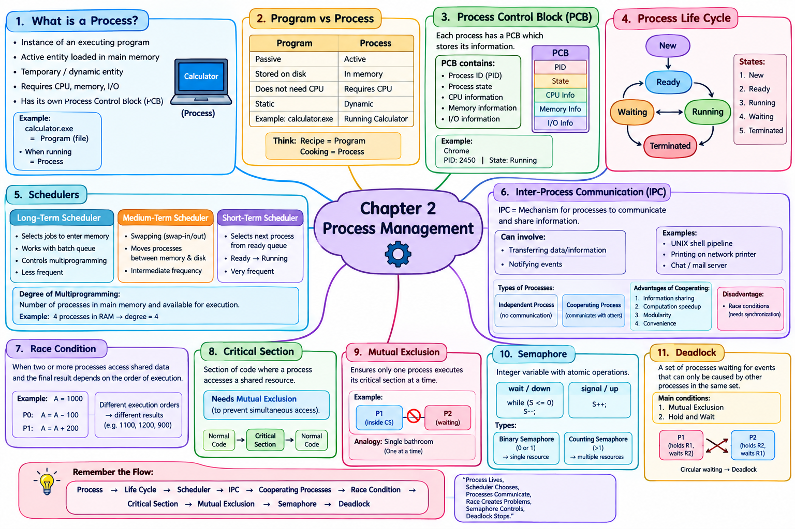

# LJ-os-sem3-chapter2-explained
# Process Management

## 1. What is a Process?

A **process** is an **instance of a program that is currently executing**.

In simple words:

> **Program = passive file/code**  
> **Process = program that is currently running**

For example, suppose you have a file:

`calculator.exe`

When the file is simply stored on your computer, it is a **program**.

When you open Calculator and it starts executing, it becomes a **process**.

The PPT describes a process as:

- an instance of an executing program,
    
- an active entity loaded into main memory,
    
- a temporary/dynamic entity,
    
- an entity requiring resources such as CPU, memory and I/O,
    
- and an entity having its own **Process Control Block (PCB)**.
    

### Example

Imagine you open Chrome.

```text
Chrome.exe
    ↓
You double-click Chrome
    ↓
Operating System loads it into RAM
    ↓
Chrome starts executing
    ↓
Chrome = Process
```

If you open Chrome multiple times or create multiple processes internally, the OS manages those processes separately.

---

# 2. Program vs Process

This is an important concept.

|Program|Process|
|---|---|
|Passive|Active|
|Stored on disk|Executing in memory|
|Does not require CPU while inactive|Requires CPU during execution|
|Static|Dynamic|
|Example: `calculator.exe`|Running Calculator|

### Easy example

Think of a **recipe** and **cooking**.

```text
Recipe → Program
Cooking using recipe → Process
```

The recipe itself isn't doing anything.

The cooking is an active operation.

Similarly:

```text
Program → instructions
Process → instructions currently being executed
```

---

# 3. Process Control Block — PCB

Every process has its own **Process Control Block (PCB)**. The PPT specifically identifies PCB as the control block belonging to a process.

Think of PCB as the process's **identity card + information record** maintained by the operating system.

A simplified view:

```text
             PROCESS
                │
                ▼
        ┌─────────────────┐
        │      PCB        │
        ├─────────────────┤
        │ Process ID      │
        │ Process State   │
        │ CPU information │
        │ Memory info     │
        │ I/O information │
        └─────────────────┘
```

### Example

Suppose:

```text
Process: Chrome
PID: 2450
State: Running
```

The OS keeps information about this process through its PCB.

When the process terminates, its PCB is eventually deleted as described in the PPT's termination state.

---

# 4. Process Life Cycle

A process does not remain in one state throughout its entire lifetime.

It moves through different states.

The main states in the PPT are:

```text
             NEW
              │
              ▼
            READY
              │
              ▼
            RUNNING
           /       \
          /         \
         ▼           ▼
     WAITING       TERMINATED
         │
         │
         ▼
       READY
```

The PPT covers five states:

1. New
    
2. Ready
    
3. Running
    
4. Waiting
    
5. Terminated
    

---

# 5. New State

When a process is **first created**, it enters the **New** state.

The process is not yet ready to execute on the CPU.

### Example

You double-click Microsoft Word.

```text
Double-click Word
       ↓
Process is created
       ↓
NEW
```

The process then proceeds toward the Ready state.

The PPT states that in New state, the process awaits entry into the Ready state.

---

# 6. Ready State

After creation, the process enters the **Ready** state.

Here:

> The process is ready to execute but is waiting for CPU time.

The process has been loaded into main memory and waits in the **ready queue**.

### Example

Suppose three processes are ready:

```text
Ready Queue

P1 → P2 → P3
```

But the CPU can execute only one process at a particular moment.

The processes are therefore waiting for their turn.

```text
CPU
 ↓
P1

Ready Queue
P2 → P3
```

---

# 7. Running State

When the CPU selects a process from the Ready state, that process enters the **Running** state.

The instructions of the process are executed by an available CPU core.

Example:

```text
Ready Queue
P1 → P2 → P3
      ↓
    Scheduler
      ↓
     CPU
      ↓
    P1 RUNNING
```

The CPU is now executing P1's instructions.

---

# 8. Waiting / Blocked State

Sometimes a process cannot continue because it needs something else.

For example:

- I/O operation
    
- User input
    
- A critical-section lock that is currently unavailable
    

The process enters the **Waiting/Blocked** state.

### Example

Suppose a program wants to read a file:

```text
Process
   ↓
Needs disk I/O
   ↓
WAITING
   ↓
Disk completes operation
   ↓
READY
```

The important point is:

> While waiting for I/O, the process does not need the CPU.

Once the I/O operation finishes, the process returns to Ready.

---

# 9. Terminated State

When the process finishes its execution, it enters the **Terminated** state.

The PPT states that the process is killed and its PCB is deleted.

Example:

```text
Running
   ↓
Program completes
   ↓
Terminated
   ↓
PCB deleted
```

For example, you open Calculator, perform a calculation and close it.

The associated process eventually terminates.

---

# 10. Scheduler

The operating system needs to decide:

> **Which process should execute, and when?**

This is where **schedulers** are used.

The PPT identifies three types:

1. Long-Term Scheduler
    
2. Medium-Term Scheduler
    
3. Short-Term Scheduler
    

---

# 11. Long-Term Scheduler

The **Long-Term Scheduler** is the first-level scheduler.

According to the PPT, it is associated with systems supporting batch processing and works with the batch queue. It selects processes/jobs to be loaded into main memory and controls the degree of multiprogramming.

### Simple example

Suppose 100 jobs are waiting on disk:

```text
Disk / Batch Queue

J1 J2 J3 J4 J5 ... J100
```

The system doesn't necessarily put all 100 into memory.

The long-term scheduler decides which jobs should enter memory.

```text
Batch Queue
J1 J2 J3 J4 J5
      ↓
Long-Term Scheduler
      ↓
Main Memory
J1 J2 J3
```

### Important point

It runs **less frequently** than the other schedulers.

---

# 12. Degree of Multiprogramming

This phrase is important.

**Degree of multiprogramming** means approximately:

> The number of processes residing in main memory and available for execution.

For example:

```text
RAM:

P1
P2
P3
P4
```

There are four processes in memory.

Therefore, the degree of multiprogramming is **4** in this simplified example.

---

# 13. Medium-Term Scheduler

The **Medium-Term Scheduler** is the second-level scheduler.

Its main concept is **swapping**.

The PPT states that it can be found in operating systems supporting swapping and swaps processes between main memory and disk.

### Example

Suppose RAM is becoming crowded:

```text
RAM
┌───────┐
│  P1   │
│  P2   │
│  P3   │
│  P4   │
└───────┘
```

The OS can temporarily move one process to disk:

```text
RAM                 Disk

P1                  P4
P2                  ↑
P3             swapped out
```

This is called **swap-out**.

Later, the process can be brought back:

```text
Disk
 P4
 ↓
RAM
 P4
```

This is **swap-in**.

---

# 14. Short-Term Scheduler

The **Short-Term Scheduler** is the third-level scheduler.

It works with the **Ready Queue** and selects which ready process should be executed by the CPU.

It controls:

```text
READY → RUNNING
```

### Example

Suppose:

```text
Ready Queue

P1 → P2 → P3
```

The short-term scheduler selects one:

```text
Ready Queue
P2 → P3

     P1
      ↓
     CPU
```

It executes **very frequently**, because CPU scheduling decisions happen repeatedly.

---

# 15. Scheduler Comparison

|Scheduler|Main job|Works with|Frequency|
|---|---|---|---|
|Long-term|Selects jobs/processes to enter memory|Batch queue|Less frequent|
|Medium-term|Swaps processes in/out of memory|Memory ↔ Disk|Intermediate|
|Short-term|Selects next process for CPU|Ready queue|Very frequent|

### Easy way to remember

```text
LONG  → Who enters?
MEDIUM → Who gets temporarily moved?
SHORT → Who gets CPU now?
```

---

# 16. Inter-Process Communication — IPC

**IPC = Inter-Process Communication**

It is the mechanism provided by the OS that allows processes to communicate with each other.

Communication can involve:

- transferring information/data
    
- notifying another process that an event occurred
    

### Real-life analogy

Imagine two students working on a project.

```text
Student A ───── message ─────> Student B
```

They need communication to coordinate.

Similarly:

```text
Process P1 ───── data/message ─────> Process P2
```

The OS provides mechanisms for this communication.

---

# 17. IPC Examples

The PPT gives examples such as:

- UNIX shell pipeline
    
- Printing on a network printer
    
- Chat or mail server
    

### Example: Chat server

Imagine:

```text
User A
  ↓
Process P1
  ↓
Chat Server
  ↓
Process P2
  ↓
User B
```

Processes need to exchange information to deliver messages.

---

# 18. Problems in IPC

The PPT identifies three important issues:

### 1. Passing information

How can one process send information to another?

```text
P1 ───── data ─────> P2
```

### 2. Avoiding interference

Two processes shouldn't interfere with each other when accessing shared resources.

### 3. Maintaining proper sequencing

If processes have dependencies, operations must happen in the proper order.

---

# 19. Independent Process

An **independent process** does not communicate with other processes in the system.

Example:

```text
P1

No communication
with P2/P3
```

Its execution doesn't depend on other processes.

---

# 20. Cooperating Process

A **cooperating process** communicates with other processes.

Example:

```text
P1 ←→ P2 ←→ P3
```

These processes exchange information or coordinate their activities.

### Advantages

According to the PPT:

1. Information sharing
    
2. Computation speedup
    
3. Modularity
    
4. Convenience
    

### Disadvantages

Cooperating processes can create problems such as **race conditions**, so proper synchronization is necessary.

---

# 21. Race Condition

This is one of the **most important concepts** in this chapter.

A **race condition** occurs when two or more processes access shared data and the final result depends on the order in which they execute.

Let's understand it carefully.

Suppose:

```text
A = 1000
```

Two processes access A.

### Process P0

```text
Read(A)
A = A - 100
Write(A)
```

### Process P1

```text
Read(A)
A = A + 200
Write(A)
```

These operations are given in the PPT.

---

## Race Condition — Possibility 1

Suppose P0 completes first.

Initial:

```text
A = 1000
```

P0:

```text
Read A → 1000
A = 1000 - 100
A = 900
Write A
```

Now:

```text
A = 900
```

Then P1:

```text
Read A → 900
A = 900 + 200
A = 1100
Write A
```

Final:

```text
A = 1100
```

---

# 22. Race Condition — Possibility 2

Now imagine P1 reads/writes before P0 completes.

Starting:

```text
A = 1000
```

P1:

```text
Read A → 1000
A = 1000 + 200
A = 1200
Write A
```

Then P0:

```text
Read A → 1200
A = 1200 - 100
A = 1100
Write A
```

Final:

```text
A = 1100
```

The PPT illustrates different execution possibilities for P0 and P1.

The deeper problem becomes especially clear when their individual read/write operations **overlap**. For example, if both read the original `1000` before either writes:

```text
P0 reads 1000
P1 reads 1000

P0 calculates 900
P1 calculates 1200

P0 writes 900
P1 writes 1200
```

Final:

```text
A = 1200
```

But if P1 writes first and P0 writes afterward:

```text
P1 writes 1200
P0 writes 900
```

Final:

```text
A = 900
```

So the final result depends on **execution order**.

That's the essence of a race condition.

---

# 23. Critical Section

A **critical section** is a section of code where a process accesses a shared resource.

Example:

```text
Process P1

Normal Code
     ↓
Critical Section
     ↓
Access shared variable
     ↓
Normal Code
```

Suppose two processes modify the same bank-account variable:

```text
P1 → Critical Section → Account balance
P2 → Critical Section → Account balance
```

If both enter at the same time, problems may occur.

---

# 24. Mutual Exclusion

**Mutual exclusion** ensures that if one process is executing its critical section, other processes are prevented from executing their critical sections for the same shared resource.

### Simple example

Think of a single bathroom:

```text
Person A → Bathroom
Person B → WAIT
```

Person B waits until Person A leaves.

Similarly:

```text
P1 → Critical Section
P2 → WAIT
```

After P1 leaves:

```text
P2 → Critical Section
```

This prevents simultaneous access to the protected shared resource.

---

# 25. Semaphore

A **semaphore** is an integer variable accessed through atomic operations called:

- **Wait / Down**
    
- **Signal / Up**
    

The PPT defines semaphore in these terms.

Think of a semaphore as a **counter/control mechanism** that helps processes coordinate access.

---

# 26. Wait Operation

The PPT gives:

```text
wait(S)
{
    while (S <= 0);
    S--;
}
```

The wait operation decreases S when S is positive. If S is zero or negative, the process waits.

### Example

Suppose:

```text
S = 1
```

Process P1 executes:

```text
wait(S)
```

Since:

```text
S > 0
```

it can proceed:

```text
S = 0
```

Another process trying to perform `wait(S)` must wait while the semaphore is unavailable.

---

# 27. Signal Operation

The signal operation increments the semaphore.

```text
signal(S)
{
    S++;
}
```

This is the operation shown in the PPT.

For example:

```text
S = 0

signal(S)

S = 1
```

This indicates that the resource/access condition has been released or made available.

---

# 28. Types of Semaphores

The PPT lists two types:

### 1. Binary Semaphore

Its value is generally:

```text
0 or 1
```

It is useful when controlling access to a single resource/critical section.

Think:

```text
1 → available
0 → unavailable
```

### 2. Counting Semaphore

It can represent multiple available instances of a resource.

For example:

```text
S = 3
```

could represent three available resources.

The PPT explicitly lists Binary Semaphore and Counting Semaphore.

---

# 29. Deadlock

This is another major exam topic.

The PPT defines deadlock as a situation where a set of processes is waiting for events that can only be caused by other processes in the same set.

In simple words:

> **Everyone is waiting, and nobody can proceed.**

### Real-life example

Imagine:

```text
Person A has Key 1
Person B has Key 2

A needs Key 2
B needs Key 1
```

So:

```text
A → waiting for B
B → waiting for A
```

Neither can continue.

That's the basic idea of deadlock.

---

# 30. Deadlock Example with Processes

Suppose:

```text
P1 has Resource R1
P2 has Resource R2
```

Now:

```text
P1 requests R2
P2 requests R1
```

But:

```text
R2 → held by P2
R1 → held by P1
```

Therefore:

```text
P1 → waiting for P2
P2 → waiting for P1
```

Neither process releases its resource.

```text
        R1
        ↑
        │
       P1
        │
        ↓
       R2
        ↑
        │
       P2
        │
        └────────→ R1
```

This creates a circular waiting situation.

---

# 31. Mutual Exclusion in Deadlock

The PPT identifies **Mutual Exclusion** as one of the deadlock conditions.

A resource can be assigned to exactly one process at a time. If another process requests that resource while it is unavailable, that process waits.

Example:

```text
Printer → P1
```

If P2 wants the same printer:

```text
P2 → WAIT
```

because P1 currently has it.

---

# 32. Hold and Wait

The PPT also identifies **Hold and Wait**.

It means a process is holding at least one resource while waiting for additional resources currently held by other processes.

### Example

```text
P1 holds R1
P1 wants R2

P2 holds R2
P2 wants R1
```

Now:

```text
P1 → holding R1 + waiting for R2
P2 → holding R2 + waiting for R1
```

This can lead to deadlock.

---

# ⭐ Complete Chapter Flow

You should understand the chapter as one connected story:

```text
                    PROCESS
                       │
                       ▼
                PROCESS LIFE CYCLE
                       │
       ┌───────────────┼────────────────┐
       ▼               ▼                ▼
      NEW            READY           WAITING
                       │                │
                       ▼                │
                    RUNNING ◄──────────┘
                       │
                       ▼
                  TERMINATED
```

Then comes scheduling:

```text
                 SCHEDULERS
                     │
       ┌─────────────┼─────────────┐
       ▼             ▼             ▼
     LONG          MEDIUM         SHORT
       │             │             │
       ▼             ▼             ▼
   Batch Queue   Swap In/Out    Ready Queue
```

Then communication:

```text
          IPC
           │
     ┌─────┴─────┐
     ▼           ▼
Independent   Cooperating
                │
                ▼
          Shared Data
                │
                ▼
         Race Condition
                │
                ▼
        Critical Section
                │
                ▼
       Mutual Exclusion
                │
                ▼
            Semaphore
```

And finally:

```text
       RESOURCE ALLOCATION
               │
               ▼
            DEADLOCK
               │
       ┌───────┴────────┐
       ▼                ▼
 Mutual Exclusion   Hold & Wait
```

## 🔥 Most Important Exam Points

If you're preparing this chapter for an exam, make sure you can explain these **without memorizing blindly**:

1. **Process and its characteristics**
    
2. **Program vs Process**
    
3. **PCB**
    
4. **Five process states**
    
5. **Process life-cycle transitions**
    
6. **Long-, Medium-, and Short-Term Scheduler**
    
7. **Degree of multiprogramming**
    
8. **IPC**
    
9. **Independent vs Cooperating Processes**
    
10. **Advantages/disadvantages of cooperating processes**
    
11. **Race Condition — especially the A = 1000 example**
    
12. **Critical Section**
    
13. **Mutual Exclusion**
    
14. **Semaphore**
    
15. **Wait and Signal**
    
16. **Binary vs Counting Semaphore**
    
17. **Deadlock**
    
18. **Mutual Exclusion and Hold & Wait in deadlock**
    

If you want to study this exactly like your **Chapter 1 preparation**, the next useful step is to turn this Chapter 2 PPT into **complete 1-mark, MCQ, 2-mark, 3-mark, and 4-mark questions with answers**, without repeating questions.


# Mindmap


<p align="center">
  
</p>

## Question & Answer Bank

<h3>1 Mark</h3>

Based strictly on your **Chapter 2 PPT: Process Management**.

### Q1. What is a process?

**Answer:** A process is an instance of an executing program. It is an active entity loaded into main memory.

### Q2. What are the characteristics of a process?

**Answer:** A process has a limited lifespan, is dynamic, requires CPU/memory/I/O resources, and has a Process Control Block (PCB).

### Q3. What is PCB?

**Answer:** PCB stands for **Process Control Block**. It is associated with a process and contains information needed for managing the process.

### Q4. What are the five basic states of a process?

**Answer:**

1. New
2. Ready
3. Running
4. Waiting
5. Terminated

### Q5. What is the New state?

**Answer:** The New state is the state in which a process is being created.

### Q6. What is the Ready state?

**Answer:** In the Ready state, a process is prepared to execute and waits for CPU allocation.

### Q7. What is the Running state?

**Answer:** In the Running state, the process is currently executing on the CPU.

### Q8. What is the Waiting state?

**Answer:** In the Waiting state, a process waits for an event such as I/O, user input, or a critical-region lock.

### Q9. What happens after a process completes its execution?

**Answer:** It enters the **Terminated** state, where the process is killed and its PCB is deleted.

### Q10. What is a scheduler?

**Answer:** A scheduler selects processes for execution and controls their movement through scheduling-related states.

### Q11. Name the three types of schedulers.

**Answer:**

1. Long-term scheduler
2. Medium-term scheduler
3. Short-term scheduler

### Q12. What is a Long-term scheduler?

**Answer:** It selects jobs/processes from the batch queue and loads them into main memory for execution.

### Q13. What does the Long-term scheduler control?

**Answer:** It controls the **degree of multiprogramming**.

### Q14. How frequently does the Long-term scheduler operate?

**Answer:** It operates less frequently.

### Q15. What is a Medium-term scheduler?

**Answer:** The Medium-term scheduler supports swapping by moving processes between main memory and disk.

### Q16. What does the Medium-term scheduler control?

**Answer:** It controls the **degree of multiprogramming** using swapping.

### Q17. What is a Short-term scheduler?

**Answer:** It selects the next process from the Ready queue and allocates the CPU to it.

### Q18. How frequently does the Short-term scheduler operate?

**Answer:** It operates very frequently.

### Q19. Which scheduler controls the Ready → Running transition?

**Answer:** The **Short-term scheduler**.

### Q20. What is IPC?

**Answer:** IPC stands for **Inter-Process Communication**. It is an operating-system mechanism that allows processes to communicate.

### Q21. What are the two main purposes of IPC?

**Answer:**

- Event notification
- Data transfer

### Q22. Give one example of IPC.

**Answer:** A **UNIX shell pipeline** is an example of IPC.

### Q23. What is an independent process?

**Answer:** An independent process is a process that does not communicate with other processes.

### Q24. What is a cooperating process?

**Answer:** A cooperating process is a process that communicates with other processes.

### Q25. Give one advantage of cooperating processes.

**Answer:** **Information sharing** is one advantage of cooperating processes.

### Q26. What is a race condition?

**Answer:** A race condition occurs when multiple processes access and modify shared data, and the final result depends on the order of execution.

### Q27. What is a critical section?

**Answer:** A critical section is the part of a program where a shared resource is accessed.

### Q28. What is mutual exclusion?

**Answer:** Mutual exclusion ensures that when one process executes its critical section, other processes are excluded from executing their critical sections.

### Q29. What is a semaphore?

**Answer:** A semaphore is an integer variable used for process synchronization, operated using atomic **Down/Wait** and **Up/Signal** operations.

### Q30. What are the two basic semaphore operations?

**Answer:**

1. Down / Wait
2. Up / Signal

### Q31. What does the Wait operation do?

**Answer:** The Wait operation decrements the semaphore when its value is positive.

### Q32. What does the Signal operation do?

**Answer:** The Signal operation increments the semaphore.

### Q33. What are the two types of semaphores?

**Answer:**

1. Binary semaphore
2. Counting semaphore

### Q34. What is a deadlock?

**Answer:** Deadlock is a situation in which processes become unable to proceed because they are waiting for resources or conditions that prevent further progress.

### Q35. Name two conditions associated with deadlock given in the chapter.

**Answer:**

1. Mutual exclusion
2. Hold and wait

### Q36. What is hold and wait?

**Answer:** Hold and wait is a condition in which a process holds resources while waiting for additional resources.

### Q37. What is the degree of multiprogramming?

**Answer:** It refers to the number of processes maintained in the system's multiprogramming environment.

### Q38. What does the Short-term scheduler use to select processes?

**Answer:** It selects processes from the **Ready queue**.

### Q39. What does the Medium-term scheduler use swapping for?

**Answer:** It swaps processes between **main memory and disk**.

### Q40. Why is synchronization needed for cooperating processes?

**Answer:** Cooperating processes can cause **race conditions**, so synchronization is needed to coordinate their access to shared resources.

### Q41. What is the lifespan of a process?

**Answer:** A process has a **limited lifespan**.

### Q42. Is a process static or dynamic?

**Answer:** A process is a **dynamic entity**.

### Q43. Where is an active process loaded?

**Answer:** An active process is loaded into **main memory**.

### Q44. What resources does a process require?

**Answer:** A process requires **CPU, memory, and I/O resources**.

### Q45. What happens to a process while waiting for I/O?

**Answer:** It remains in memory and does not require the CPU while waiting for I/O.

### Q46. After completing I/O, which state does a process return to?

**Answer:** It returns to the **Ready state**.

### Q47. What happens to the PCB when a process terminates?

**Answer:** The **PCB is deleted**.

### Q48. Which scheduler is associated with batch systems?

**Answer:** The **Long-term scheduler**.

### Q49. What does the Long-term scheduler select?

**Answer:** It selects the next **job/process from the batch queue**.

### Q50. Where does the Long-term scheduler load selected processes?

**Answer:** It loads them into **main memory**.

### Q51. Which scheduler is the second-level scheduler?

**Answer:** The **Medium-term scheduler**.

### Q52. What operation is supported by the Medium-term scheduler?

**Answer:** **Swapping**.

### Q53. Between which two locations does the Medium-term scheduler swap processes?

**Answer:** Between **main memory and disk**.

### Q54. Which scheduler is the third-level scheduler?

**Answer:** The **Short-term scheduler**.

### Q55. Is the Short-term scheduler present in modern operating systems?

**Answer:** **Yes**, it is always present in modern operating systems.

### Q56. What does the Short-term scheduler select?

**Answer:** It selects the next process from the **Ready queue**.

### Q57. What does IPC allow processes to do?

**Answer:** IPC allows processes to **communicate with each other**.

### Q58. Name one issue involved in IPC.

**Answer:** **Passing information** is one issue involved in IPC.

### Q59. What is one disadvantage of cooperating processes?

**Answer:** Cooperating processes can cause **race conditions** and require synchronization.

### Q60. What are the two types of semaphore?

**Answer:** **Binary semaphore and Counting semaphore.**

### 2-Mark Questions — Q1 to Q15

### Q1. Define a process and mention two characteristics of a process.

**Answer:**  
A process is an instance of an executing program. It is an active entity loaded into main memory.

Two characteristics are:

1. It has a limited lifespan.
2. It is a dynamic entity.

---

### Q2. Explain the New and Ready states of a process.

**Answer:**

- **New:** The process is being created.
- **Ready:** The process is prepared to execute and waits for CPU allocation.

---

### Q3. Explain the Running and Waiting states.

**Answer:**

- **Running:** The process is currently executing on the CPU.
- **Waiting:** The process waits for an event such as I/O, user input, or a critical-region lock.

---

### Q4. What happens when a process enters the Terminated state?

**Answer:**  
When a process enters the Terminated state, the process is killed and its **PCB is deleted**.

---

### Q5. What are the three types of schedulers?

**Answer:**  
The three types are:

1. **Long-term scheduler**
2. **Medium-term scheduler**
3. **Short-term scheduler**

---

### Q6. Explain the function of the Long-term scheduler.

**Answer:**  
The Long-term scheduler:

1. Selects the next job/process from the batch queue.
2. Loads the selected process into main memory.
3. Controls the degree of multiprogramming.

---

### Q7. What is the role of the Medium-term scheduler?

**Answer:**  
The Medium-term scheduler supports **swapping**. It swaps processes between **main memory and disk** and helps control the degree of multiprogramming.

---

### Q8. Explain the function of the Short-term scheduler.

**Answer:**  
The Short-term scheduler:

1. Selects the next process from the Ready queue.
2. Allocates the CPU to the selected process.
3. Controls the Ready → Running transition.

---

### Q9. Differentiate between Long-term and Short-term schedulers.

**Answer:**

| Long-term Scheduler                          | Short-term Scheduler                    |
| -------------------------------------------- | --------------------------------------- |
| Selects jobs/processes from the batch queue. | Selects processes from the Ready queue. |
| Operates less frequently.                    | Operates very frequently.               |
| Loads processes into main memory.            | Selects the next process for the CPU.   |

---

### Q10. What is IPC? Mention its two purposes.

**Answer:**  
**IPC (Inter-Process Communication)** is an operating-system mechanism that allows processes to communicate.

Its two purposes are:

1. **Event notification**
2. **Data transfer**

---

### Q11. Give two examples of IPC.

**Answer:**  
Two examples are:

1. **UNIX shell pipeline**
2. **Network printer communication**

---

### Q12. Differentiate between independent and cooperating processes.

**Answer:**

| Independent Process                          | Cooperating Process                                 |
| -------------------------------------------- | --------------------------------------------------- |
| Does not communicate with other processes.   | Communicates with other processes.                  |
| Does not participate in process cooperation. | Can share information and cooperate in computation. |

---

### Q13. Mention two advantages of cooperating processes.

**Answer:**  
Two advantages are:

1. **Information sharing**
2. **Computation speedup**

---

### Q14. What is a race condition? Give its basic cause.

**Answer:**  
A race condition occurs when multiple processes access and modify **shared data**, and the result can depend on the order in which their operations occur.

---

### Q15. What is a critical section and why is mutual exclusion required?

**Answer:**  
A **critical section** is the part of a program where a shared resource is accessed.

**Mutual exclusion** is required so that when one process executes its critical section, other processes are excluded from executing their critical sections.

### Q16. Mention three issues that need to be considered in IPC.

**Answer:**

1. Passing information between processes.
2. Avoiding interference between processes.
3. Maintaining proper sequencing between processes.

---

### Q17. What are the advantages of cooperating processes?

**Answer:**  
The main advantages are:

1. Information sharing
2. Computation speedup
3. Modularity
4. Convenience

---

### Q18. Why can cooperating processes require synchronization?

**Answer:**  
Cooperating processes may access shared data simultaneously, which can lead to **race conditions**. Therefore, synchronization is required to coordinate their access.

---

### Q19. Explain the race-condition example involving shared integer A.

**Answer:**  
Suppose shared integer **A = 1000**.

- Process P0 performs: **Read(A) → A = A − 100 → Write(A)**
- Process P1 performs: **Read(A) → A = A + 200 → Write(A)**

Because both processes access the same shared variable, the final value can depend on their execution order.

---

### Q20. What is the purpose of a critical section?

**Answer:**  
A critical section contains the code where a **shared resource is accessed**. Controlling access to it prevents multiple processes from interfering with each other.

---

### Q21. Explain mutual exclusion.

**Answer:**  
Mutual exclusion ensures that if **one process is executing its critical section**, other processes are excluded from executing their critical sections at the same time.

---

### Q22. Define semaphore and state its basic operations.

**Answer:**  
A semaphore is an **integer variable** used for process synchronization.

Its two basic atomic operations are:

1. **Down / Wait**
2. **Up / Signal**

---

### Q23. Explain the Wait (Down) operation of a semaphore.

**Answer:**  
The **Wait/Down** operation checks the semaphore value. When the value is positive, it is decremented.

---

### Q24. Explain the Signal (Up) operation of a semaphore.

**Answer:**  
The **Signal/Up** operation increments the value of the semaphore.

---

### Q25. What are the two types of semaphores?

**Answer:**

1. **Binary semaphore**
2. **Counting semaphore**

---

### Q26. What is a binary semaphore?

**Answer:**  
A binary semaphore is a type of semaphore identified in the chapter as one of the two basic semaphore types. Its value is used for binary synchronization.

---

### Q27. What is a counting semaphore?

**Answer:**  
A counting semaphore is a type of semaphore used when synchronization involves a count of available resources.

> **Note:** The PPT names Binary and Counting semaphores but does not provide further detailed definitions for each type.

---

### Q28. What is deadlock?

**Answer:**  
Deadlock is a situation in which processes cannot proceed because they are waiting for resources or conditions that prevent further progress.

---

### Q29. What are two conditions associated with deadlock in the chapter?

**Answer:**

1. **Mutual exclusion**
2. **Hold and wait**

---

### Q30. Explain hold and wait.

**Answer:**  
**Hold and wait** is a condition in which a process **holds a resource while waiting for another resource**.
### Q31. What is the relationship between IPC and cooperating processes?

**Answer:**  
IPC provides the mechanism through which **cooperating processes communicate** with each other. It supports event notification and data transfer.

### Q32. Mention two problems that can occur when processes share data.

**Answer:**

1. **Race conditions**
2. **Interference between processes**

### Q33. Why is process synchronization important?

**Answer:**  
Synchronization is important because cooperating processes may access shared data. Without proper coordination, a **race condition** can occur.

### Q34. What is the purpose of mutual exclusion in a critical section?

**Answer:**  
It ensures that only one process executes its critical section at a time, preventing other processes from entering the same critical section simultaneously.

### Q35. What are the basic operations performed on a semaphore?

**Answer:**

1. **Down/Wait** — decrements the semaphore when its value is positive.
2. **Up/Signal** — increments the semaphore.

### Q36. Why are semaphore operations atomic?

**Answer:**  
The PPT specifies that **Down/Wait and Up/Signal are atomic operations**, so they are treated as indivisible synchronization operations.

### Q37. Differentiate between Binary and Counting semaphores.

**Answer:**

|Binary Semaphore|Counting Semaphore|
|---|---|
|One of the two semaphore types.|One of the two semaphore types.|
|Used for binary synchronization.|Uses a count for synchronization.|

**Note:** The PPT names these two types but does not provide further detailed definitions.

### Q38. What happens to a process when it is waiting for user input?

**Answer:**  
The process enters the **Waiting state**. It remains in memory and does not require the CPU while waiting.

### Q39. What happens after a process completes its I/O operation?

**Answer:**  
After completing I/O, the process returns to the **Ready state**.

### Q40. Why does the Long-term scheduler operate less frequently?

**Answer:**  
The PPT states that the Long-term scheduler operates **less frequently** because it selects jobs/processes from the batch queue and loads them into main memory.

### Q41. Which scheduler is responsible for selecting a process for the CPU?

**Answer:**  
The **Short-term scheduler** selects the next process from the Ready queue for the CPU.

### Q42. What is the function of the batch queue?

**Answer:**  
The batch queue contains jobs/processes from which the **Long-term scheduler selects the next job/process**.

### Q43. How does the Medium-term scheduler use swapping?

**Answer:**  
It swaps processes **between main memory and disk** as part of its scheduling function.

### Q44. Which scheduler controls the Ready → Running transition?

**Answer:**  
The **Short-term scheduler** controls the Ready → Running transition.

### Q45. Mention two resources required by a process.

**Answer:**  
A process requires resources such as:

1. **CPU**
2. **Memory**

It can also require I/O resources.

### Q46. Why is a process considered an active entity?

**Answer:**  
A process is considered active because it represents an **executing program** and is loaded into main memory.

### Q47. What is the purpose of IPC in data transfer?

**Answer:**  
IPC provides an operating-system mechanism that allows processes to **transfer data** between one another.

### Q48. Mention two examples where IPC can be used.

**Answer:**

1. **UNIX shell pipeline**
2. **Chat/mail server**

### Q49. How can the order of process execution affect shared data?

**Answer:**  
When processes access and modify shared data, different execution orders can produce different results. This situation is called a **race condition**.

### Q50. What are the two deadlock conditions mentioned in the PPT?

**Answer:**

1. **Mutual exclusion**
2. **Hold and wait**

# 3-Mark Questions — Q1 to Q40

Based on your **Chapter 2 PPT: Process Management**.

---

### Q1. Define a process and explain its main characteristics.

**Answer:**  
A process is an **instance of an executing program** and is an active entity loaded into main memory.

Main characteristics:

1. It has a **limited lifespan**.
2. It is a **dynamic entity**.
3. It requires **CPU, memory, and I/O resources**.
4. It has a **Process Control Block (PCB)**.

---

### Q2. Explain the five basic states of a process.

**Answer:**

1. **New:** Process is being created.
2. **Ready:** Process is prepared to execute and waits for CPU allocation.
3. **Running:** Process is currently executing.
4. **Waiting:** Process waits for an event such as I/O or user input.
5. **Terminated:** Process has completed and is killed.

---

### Q3. Explain the New, Ready, and Running states.

**Answer:**

- **New:** The process is being created.
- **Ready:** The process is ready to execute but is waiting for CPU allocation.
- **Running:** The process is currently executing on the CPU.

---

### Q4. Explain the Waiting and Terminated states.

**Answer:**

- **Waiting:** The process waits for an event such as I/O, user input, or a critical-region lock.
- **Terminated:** The process is killed after completion and its PCB is deleted.

---

### Q5. Explain the three types of schedulers.

**Answer:**

1. **Long-term scheduler:** Selects jobs/processes from the batch queue and loads them into main memory.
2. **Medium-term scheduler:** Swaps processes between main memory and disk.
3. **Short-term scheduler:** Selects the next process from the Ready queue for CPU execution.

---

### Q6. Explain the Long-term scheduler.

**Answer:**  
The Long-term scheduler:

1. Is the **first-level scheduler**.
2. Selects the next job/process from the **batch queue**.
3. Loads selected processes into **main memory**.
4. Controls the **degree of multiprogramming**.
5. Operates less frequently.

---

### Q7. Explain the Medium-term scheduler.

**Answer:**  
The Medium-term scheduler:

1. Is the **second-level scheduler**.
2. Supports **swapping**.
3. Swaps processes between **main memory and disk**.
4. Helps control the **degree of multiprogramming**.

---

### Q8. Explain the Short-term scheduler.

**Answer:**  
The Short-term scheduler:

1. Is the **third-level scheduler**.
2. Selects a process from the **Ready queue**.
3. Selects the next process for the **CPU**.
4. Controls the **Ready → Running** transition.
5. Operates very frequently.

---

### Q9. Compare Long-term, Medium-term, and Short-term schedulers.

**Answer:**

|Scheduler|Main Function|
|---|---|
|**Long-term**|Selects jobs and loads them into main memory|
|**Medium-term**|Swaps processes between memory and disk|
|**Short-term**|Selects the next process for CPU execution|

---

### Q10. Explain the role of the Long-term scheduler in multiprogramming.

**Answer:**  
The Long-term scheduler:

1. Selects processes from the batch queue.
2. Loads selected processes into main memory.
3. Controls the **degree of multiprogramming**.
4. Therefore, it determines which jobs enter the multiprogramming environment.

---

### Q11. Explain swapping performed by the Medium-term scheduler.

**Answer:**  
The Medium-term scheduler supports swapping by:

1. Taking processes from **main memory**.
2. Moving them to **disk** when required.
3. Moving processes between disk and main memory as part of scheduling.
4. Helping control the degree of multiprogramming.

---

### Q12. Why is the Short-term scheduler important?

**Answer:**  
The Short-term scheduler is important because:

1. It selects processes from the Ready queue.
2. It decides which process gets the CPU next.
3. It controls the Ready → Running transition.
4. It operates very frequently.

---

### Q13. Define IPC and explain its purposes.

**Answer:**  
**IPC (Inter-Process Communication)** is an operating-system mechanism that allows processes to communicate.

Its purposes include:

1. **Event notification**
2. **Data transfer**
3. Supporting communication between processes.

---

### Q14. Explain three examples of IPC.

**Answer:**  
Examples of IPC include:

1. **UNIX shell pipeline**
2. **Network printer communication**
3. **Chat/mail server communication**

---

### Q15. What are the important issues in IPC?

**Answer:**  
Important IPC issues include:

1. **Passing information** between processes.
2. **Avoiding interference** between processes.
3. Maintaining proper **sequencing** between processes.

---

### Q16. Differentiate between independent and cooperating processes.

**Answer:**

|Independent Process|Cooperating Process|
|---|---|
|Does not communicate with other processes.|Communicates with other processes.|
|Does not cooperate with other processes.|Can cooperate with other processes.|
|Does not require IPC for communication with other processes.|Uses communication mechanisms such as IPC.|

---

### Q17. Explain the advantages of cooperating processes.

**Answer:**  
Cooperating processes provide:

1. **Information sharing**
2. **Computation speedup**
3. **Modularity**
4. **Convenience**

However, cooperating processes can also introduce race conditions and require synchronization.

---

### Q18. What are the disadvantages or problems associated with cooperating processes?

**Answer:**  
Cooperating processes can:

1. Cause **race conditions** when accessing shared data.
2. Require **process synchronization**.
3. Need coordination to avoid interference and maintain correct sequencing.

---

### Q19. Explain race condition with an example.

**Answer:**  
A race condition occurs when multiple processes access and modify shared data and the result depends on their execution order.

Example:

- Initial value: **A = 1000**
- P0: `Read(A) → A = A - 100 → Write(A)`
- P1: `Read(A) → A = A + 200 → Write(A)`

The execution order can affect the final value of the shared variable.

---

### Q20. Why does a race condition occur?

**Answer:**  
A race condition occurs because:

1. Multiple processes access the **same shared data**.
2. They may modify the data simultaneously or in different orders.
3. The final result can therefore depend on the **order of execution**.

---

### Q21. Explain the critical section.

**Answer:**  
A critical section is:

1. A **code segment** of a process.
2. It contains access to a **shared resource**.
3. Access to the critical section must be controlled to prevent interference between processes.
4. Mutual exclusion is used so that processes do not execute conflicting critical sections simultaneously.

---

### Q22. Explain mutual exclusion with respect to a critical section.

**Answer:**  
Mutual exclusion means:

1. A process entering its critical section gets exclusive access.
2. Other processes are prevented from entering their critical sections simultaneously.
3. This prevents conflicting access to shared resources.

---

### Q23. How are race conditions and critical sections related?

**Answer:**

1. A race condition can occur when processes access shared data.
2. The code that accesses the shared resource is placed in a **critical section**.
3. **Mutual exclusion** prevents multiple processes from executing conflicting critical sections at the same time.

---

### Q24. Define semaphore and explain its operations.

**Answer:**  
A semaphore is an **integer variable** used for synchronization.

Its operations are:

1. **Down/Wait:** Decrements the semaphore when its value is positive.
2. **Up/Signal:** Increments the semaphore.
3. These operations are **atomic**.

---

### Q25. Explain the Wait/Down operation of a semaphore.

**Answer:**  
The Wait/Down operation:

1. Checks the semaphore value.
2. If the value is positive, the value is decremented.
3. It is an atomic synchronization operation.

---

### Q26. Explain the Signal/Up operation of a semaphore.

**Answer:**  
The Signal/Up operation:

1. Operates on the semaphore atomically.
2. Increments the semaphore value.
3. It is used as the corresponding operation to Wait/Down in synchronization.

---

### Q27. Explain Binary and Counting semaphores.

**Answer:**  
The PPT identifies two types:

1. **Binary semaphore**
2. **Counting semaphore**

They are the two basic categories of semaphores used for synchronization. The PPT does not provide further detailed definitions of these two types.

---

### Q28. What is deadlock?

**Answer:**  
Deadlock is a situation where processes are unable to proceed because they are waiting for resources or conditions that prevent further progress.

The chapter associates deadlock with conditions including:

1. **Mutual exclusion**
2. **Hold and wait**

---

### Q29. Explain mutual exclusion as a deadlock condition.

**Answer:**  
Mutual exclusion means:

1. A resource is being used in an exclusive manner.
2. More than one process cannot use the same resource simultaneously.
3. It is one of the conditions associated with deadlock in the chapter.

---

### Q30. Explain hold and wait as a deadlock condition.

**Answer:**  
Hold and wait means:

1. A process is **holding a resource**.
2. At the same time, it is **waiting for another resource**.
3. Hold and wait is identified as one of the deadlock conditions in the chapter.

---

### Q31. Explain the relationship between process management and scheduling.

**Answer:**  
Process management deals with processes throughout their life cycle. Scheduling helps determine which process should receive CPU time.

The schedulers include:

1. Long-term scheduler
2. Medium-term scheduler
3. Short-term scheduler.

---

### Q32. Explain how a process moves through its life cycle.

**Answer:**  
A process passes through several states:

1. **New** — process is created.
2. **Ready** — waits for CPU allocation.
3. **Running** — executes on the CPU.
4. **Waiting** — waits for an event such as I/O.
5. **Terminated** — process is completed and killed.

---

### Q33. Explain the relationship between Waiting and Ready states.

**Answer:**

1. A process enters the **Waiting** state when it waits for I/O, user input, or another event.
2. While waiting, it remains in memory and does not require the CPU.
3. After the required I/O is completed, it returns to the **Ready** state.

---

### Q34. Explain how the three schedulers operate at different levels.

**Answer:**

1. **Long-term:** First-level scheduler; selects jobs/processes and loads them into memory.
2. **Medium-term:** Second-level scheduler; handles swapping between memory and disk.
3. **Short-term:** Third-level scheduler; selects a Ready process for CPU execution.

---

### Q35. Explain why synchronization is required in process management.

**Answer:**  
Synchronization is required because:

1. Cooperating processes may share data.
2. Simultaneous access can produce **race conditions**.
3. Mutual exclusion and semaphores can be used to control access and coordinate processes.

---

### Q36. Explain how semaphores help in process synchronization.

**Answer:**  
Semaphores help synchronization by:

1. Providing an **integer variable** for synchronization.
2. Using atomic **Wait/Down** and **Signal/Up** operations.
3. Controlling access and coordination between processes.

---

### Q37. Explain the complete connection between race condition, critical section, and mutual exclusion.

**Answer:**

1. Multiple processes accessing shared data can create a **race condition**.
2. The code accessing the shared resource is placed in a **critical section**.
3. **Mutual exclusion** ensures that only one process executes its critical section at a time.

---

### Q38. Explain the connection between IPC, cooperating processes, and synchronization.

**Answer:**

1. **Cooperating processes** communicate with each other.
2. **IPC** provides the operating-system mechanism for communication, including data transfer and event notification.
3. Because cooperating processes may share data, **synchronization** is required to avoid race conditions and interference.

---

### Q39. Explain the connection between semaphores and critical sections.

**Answer:**

1. A critical section contains code that accesses a shared resource.
2. Mutual exclusion is required to prevent simultaneous conflicting access.
3. Semaphores provide synchronization operations such as **Wait/Down** and **Signal/Up** that can be used to coordinate processes.

---

### Q40. Give an overview of Process Management.

**Answer:**  
Process Management includes:

1. **Process and Process Life Cycle** — processes move through states such as New, Ready, Running, Waiting, and Terminated.
2. **Scheduling** — Long-term, Medium-term, and Short-term schedulers manage process selection.
3. **IPC and Synchronization** — processes communicate and coordinate using IPC, critical sections, mutual exclusion, and semaphores.
4. **Deadlock** — processes can encounter conditions such as mutual exclusion and hold and wait.

# 4-Mark Questions — Q1 to Q30

Based strictly on the topics and terminology covered in your Chapter 2 PPT.

---

## Q1. Explain the process and its characteristics.

**Answer:**  
A **process** is an instance of an executing program. It is an active entity loaded into main memory.

Characteristics:

1. A process has a **limited lifespan**.
2. It is a **dynamic entity**.
3. It requires **CPU, memory, and I/O resources**.
4. Every process has a **Process Control Block (PCB)**.

---

## Q2. Explain the complete process life cycle.

**Answer:**

A process passes through the following states:

1. **New:** The process is being created.
2. **Ready:** The process is ready to execute and waits for CPU allocation.
3. **Running:** The process is currently executing on the CPU.
4. **Waiting:** The process waits for an event such as I/O, user input, or a critical-region lock.
5. **Terminated:** The process is killed after completion and its PCB is deleted.

**Flow:**  
**New → Ready → Running → Waiting → Ready → Running → Terminated**

---

## Q3. Explain the three types of process schedulers.

**Answer:**

There are three types:

### 1. Long-term Scheduler

- First-level scheduler.
- Selects jobs/processes from the batch queue.
- Loads them into main memory.
- Controls degree of multiprogramming.

### 2. Medium-term Scheduler

- Second-level scheduler.
- Supports swapping.
- Moves processes between main memory and disk.

### 3. Short-term Scheduler

- Third-level scheduler.
- Selects a process from the Ready queue.
- Selects the next process for CPU execution.
- Operates very frequently.

---

## Q4. Compare the three process schedulers.

**Answer:**

|Feature|Long-term|Medium-term|Short-term|
|---|---|---|---|
|Level|First|Second|Third|
|Main function|Selects jobs|Swapping|Selects CPU process|
|Queue/Location|Batch queue|Memory/Disk|Ready queue|
|Frequency|Less frequent|—|Very frequent|
|Main purpose|Controls multiprogramming|Supports swapping|Controls CPU selection|

---

## Q5. Explain the Long-term scheduler in detail.

**Answer:**

The Long-term scheduler:

1. Is the **first-level scheduler**.
2. Is mainly associated with **batch systems**.
3. Selects the next job/process from the **batch queue**.
4. Loads the selected process into **main memory**.
5. Operates less frequently.
6. Controls the **degree of multiprogramming**.

---

## Q6. Explain the Medium-term scheduler in detail.

**Answer:**

The Medium-term scheduler:

1. Is the **second-level scheduler**.
2. Provides support for **swapping**.
3. Swaps processes between **main memory and disk**.
4. Helps control the **degree of multiprogramming**.

---

## Q7. Explain the Short-term scheduler in detail.

**Answer:**

The Short-term scheduler:

1. Is the **third-level scheduler**.
2. Is always present in modern operating systems.
3. Selects the next process from the **Ready queue**.
4. Selects the process that will use the CPU.
5. Controls the **Ready → Running** transition.
6. Operates very frequently.

---

## Q8. Explain Inter-Process Communication (IPC).

**Answer:**

**IPC** stands for **Inter-Process Communication**.

It is an operating-system mechanism that allows processes to communicate.

Its main purposes are:

1. **Event notification**
2. **Data transfer**
3. Allowing processes to exchange information.

Examples mentioned in the PPT include:

- UNIX shell pipeline
- Network printer
- Chat/mail server

---

## Q9. Explain the issues involved in IPC.

**Answer:**

Three important IPC issues are:

1. **Passing information**  
    Processes need a mechanism to exchange information.
2. **Avoiding interference**  
    Processes should not improperly interfere with one another.
3. **Sequencing**  
    Processes may need to execute or communicate in a proper sequence.

---

## Q10. Explain independent and cooperating processes.

**Answer:**

### Independent Process

An independent process does not communicate with other processes.

### Cooperating Process

A cooperating process communicates with other processes.

Cooperating processes can provide:

1. Information sharing
2. Computation speedup
3. Modularity
4. Convenience

However, they can also create race conditions and require synchronization.

---

## Q11. Explain the advantages and disadvantages of cooperating processes.

**Answer:**

### Advantages

1. **Information sharing**
2. **Computation speedup**
3. **Modularity**
4. **Convenience**

### Disadvantages/Problems

1. They may cause **race conditions**.
2. They require **synchronization**.
3. Their communication requires proper coordination.

---

## Q12. Explain race condition with the given example.

**Answer:**

A race condition occurs when multiple processes access and modify shared data and the final result depends on their execution order.

Suppose:

**A = 1000**

Process P0:

- Read(A)
- A = A − 100
- Write(A)

Process P1:

- Read(A)
- A = A + 200
- Write(A)

Since both processes access the same shared variable, the execution order can affect the final result.

---

## Q13. Explain critical section and mutual exclusion.

**Answer:**

### Critical Section

A critical section is the code segment where a **shared resource is accessed**.

### Mutual Exclusion

Mutual exclusion ensures that:

1. One process can execute its critical section.
2. Other processes are excluded from executing their critical sections simultaneously.
3. Shared resources are therefore protected from conflicting access.

---

## Q14. Explain the relationship between race condition and critical section.

**Answer:**

1. A **race condition** occurs when processes access shared data and the result depends on execution order.
2. The code that accesses a shared resource is placed in a **critical section**.
3. Access to the critical section must be controlled.
4. **Mutual exclusion** prevents conflicting simultaneous execution.

---

## Q15. Explain semaphore and its operations.

**Answer:**

A **semaphore** is an integer variable used for process synchronization.

It has two atomic operations:

### Down / Wait

- Checks the semaphore value.
- If the value is positive, it decrements the value.

### Up / Signal

- Increments the semaphore value.

These operations are used to coordinate processes.

---

## Q16. Explain the two types of semaphores.

**Answer:**

The PPT identifies two types:

1. **Binary Semaphore**
2. **Counting Semaphore**

The PPT specifically lists these two types but does **not provide detailed definitions or examples** for them. Therefore, those details should not be treated as PPT-derived material.

---

## Q17. Explain the Wait and Signal operations of a semaphore.

**Answer:**

### Wait / Down

- It checks the semaphore.
- When the value is positive, it decrements the value.
- It is an atomic operation.

### Signal / Up

- It increments the semaphore.
- It is also an atomic operation.

Both operations are used for synchronization.

---

## Q18. Explain deadlock.

**Answer:**

A **deadlock** is a situation in which processes are unable to proceed because they are waiting for resources or conditions that prevent further progress.

The PPT identifies conditions associated with deadlock, including:

1. **Mutual exclusion**
2. **Hold and wait**

---

## Q19. Explain mutual exclusion and hold-and-wait conditions of deadlock.

**Answer:**

### Mutual Exclusion

A resource is used exclusively, so processes cannot simultaneously use the same resource.

### Hold and Wait

A process holds a resource while waiting for another resource.

Both are identified in the PPT as conditions associated with deadlock.

---

## Q20. Explain the relationship between synchronization and deadlock.

**Answer:**

1. Process synchronization is required when cooperating processes share resources.
2. Synchronization uses mechanisms such as critical sections and semaphores.
3. Improper resource-related conditions can contribute to situations such as deadlock.
4. The PPT identifies **mutual exclusion** and **hold and wait** as deadlock conditions.

---

## Q21. Explain the complete process-state model.

**Answer:**

The process-state model contains:

**New → Ready → Running → Waiting → Ready → Running → Terminated**

- **New:** Process creation.
- **Ready:** Waiting for CPU.
- **Running:** CPU execution.
- **Waiting:** Waiting for I/O, user input, or another event.
- **Terminated:** Process is killed and PCB is deleted.

---

## Q22. Explain what happens when a running process requires I/O.

**Answer:**

1. The process is executing in the **Running** state.
2. When it needs I/O, it enters the **Waiting** state.
3. While waiting, it remains in memory and does not require the CPU.
4. After I/O is completed, it returns to the **Ready** state.

---

## Q23. Explain the role of PCB in process management.

**Answer:**

The PPT states that:

1. A process has a **Process Control Block (PCB)**.
2. The PCB is associated with the process during its lifetime.
3. When the process terminates, its **PCB is deleted**.

The PPT does not provide a detailed list of PCB fields, so those should not be added as PPT-specific answers.

---

## Q24. Explain how schedulers control process execution.

**Answer:**

Schedulers control process execution at different levels:

1. **Long-term:** Selects jobs/processes and loads them into main memory.
2. **Medium-term:** Swaps processes between memory and disk.
3. **Short-term:** Selects a process from the Ready queue and controls its transition to Running.

---

## Q25. Explain the importance of the Ready queue.

**Answer:**

1. Processes that are ready for execution wait in the **Ready queue**.
2. The Short-term scheduler selects the next process from this queue.
3. The selected process is then given the opportunity to execute on the CPU.
4. Thus, the Ready queue is directly associated with short-term scheduling.

---

## Q26. Explain the importance of the batch queue.

**Answer:**

1. The batch queue contains jobs/processes waiting to be selected.
2. The **Long-term scheduler** selects the next job/process from it.
3. The selected process is loaded into main memory.
4. The Long-term scheduler therefore controls which processes enter the multiprogramming environment.

---

## Q27. Explain how IPC and synchronization are connected.

**Answer:**

1. IPC allows processes to **communicate**.
2. Cooperating processes may share information and resources.
3. Shared access can produce **race conditions**.
4. Synchronization mechanisms such as critical sections, mutual exclusion, and semaphores help coordinate process access.

---

## Q28. Explain the major topics covered under Process Management.

**Answer:**

The chapter covers:

1. **Process** — definition and characteristics.
2. **Process Life Cycle** — New, Ready, Running, Waiting, and Terminated states.
3. **Scheduling and Scheduler** — Long-term, Medium-term, and Short-term schedulers.
4. **IPC** — communication between processes.
5. **Process Synchronization** — race condition, critical section, mutual exclusion, and semaphore.
6. **Deadlock** — including mutual exclusion and hold-and-wait conditions.

---

## Q29. Explain the complete relationship between process, scheduler, IPC, synchronization, and deadlock.

**Answer:**

1. A **process** is an executing program.
2. **Schedulers** determine which processes are selected for execution.
3. **IPC** allows processes to communicate.
4. Cooperating processes may share data, creating the possibility of **race conditions**.
5. **Synchronization**, critical sections, mutual exclusion, and semaphores help coordinate access.
6. Processes can also encounter **deadlock conditions**, including mutual exclusion and hold and wait.

---

## Q30. Explain Process Management as a whole.

**Answer:**

**Process Management** is the management of processes and their execution in an operating system.

It includes:

1. **Process and Process Life Cycle** — managing states from New to Terminated.
2. **Scheduling** — selecting processes using Long-term, Medium-term, and Short-term schedulers.
3. **IPC** — allowing processes to communicate through event notification and data transfer.
4. **Synchronization** — managing shared-resource access using critical sections, mutual exclusion, and semaphores.
5. **Deadlock** — handling situations involving conditions such as mutual exclusion and hold and wait.

# Chapter 2 — 5-Mark Questions & Answers

Here are **all 50 five-mark questions**, continuing the question bank. They are based on your Chapter 2 PPT topics and avoid simply repeating the shorter-mark questions.

---

## Q1. Explain the concept of a Process and its characteristics.

**Answer:**

A **process** is an instance of an executing program. It is an active entity that is loaded into main memory for execution.

### Characteristics:

1. A process has a **limited lifespan**.
    
2. It is a **dynamic entity** because its state changes during execution.
    
3. It requires **CPU resources** for execution.
    
4. It requires **memory resources**.
    
5. It may require **I/O operations**.
    
6. Each process has a **Process Control Block (PCB)** maintained by the operating system.
    

Therefore, a process represents a program that is currently being executed by the operating system.

---

## Q2. Explain the complete Process Life Cycle.

**Answer:**

A process passes through several states during its lifetime:

1. **New** – The process is being created.
    
2. **Ready** – The process is ready to execute and waits for CPU allocation.
    
3. **Running** – The process is currently being executed by the CPU.
    
4. **Waiting** – The process waits for an event such as I/O, user input, or a critical-region lock.
    
5. **Terminated** – The process has finished or has been killed.
    

### Flow:

**New → Ready → Running → Waiting → Ready → Running → Terminated**

The exact transition depends on CPU allocation and events occurring during execution.

---

## Q3. Explain the New, Ready and Running states of a process.

**Answer:**

### 1. New State

The process is being created by the operating system.

### 2. Ready State

The process is prepared to execute but is waiting for CPU allocation.

### 3. Running State

The process is currently executing instructions using the CPU.

A process generally moves from:

**New → Ready → Running**

The scheduler selects a process from the Ready state and allocates the CPU to it.

---

## Q4. Explain the Waiting and Terminated states.

**Answer:**

### Waiting State

A process enters the Waiting state when it must wait for something before continuing execution.

Examples include:

- I/O completion
    
- User input
    
- Availability of a critical-region lock
    

The process remains in memory but does not require the CPU during this period.

After the required event occurs, the process can return to the Ready state.

### Terminated State

A process enters the Terminated state when its execution ends or it is killed. Its PCB is then deleted by the operating system.

---

## Q5. Explain the three types of schedulers in an operating system.

**Answer:**

There are three types of schedulers:

### 1. Long-Term Scheduler

Selects jobs/processes from the batch queue and loads them into main memory.

### 2. Medium-Term Scheduler

Supports swapping by moving processes between main memory and disk.

### 3. Short-Term Scheduler

Selects a process from the Ready queue and allocates the CPU to it.

Thus, the three schedulers operate at different levels and frequencies in process management.

---

## Q6. Explain the Long-Term Scheduler in detail.

**Answer:**

The **Long-Term Scheduler** is the first-level scheduler.

Its functions are:

1. It operates with the **batch queue**.
    
2. It selects the next job/process.
    
3. It loads the selected process into **main memory**.
    
4. It controls the **degree of multiprogramming**.
    
5. It operates **less frequently** compared with the short-term scheduler.
    

Therefore, its major responsibility is deciding which jobs should be brought into memory for execution.

---

## Q7. Explain the Medium-Term Scheduler in detail.

**Answer:**

The **Medium-Term Scheduler** is the second-level scheduler.

Its main functions are:

1. It provides support for **swapping**.
    
2. It moves processes between **main memory and disk**.
    
3. It can temporarily remove processes from memory.
    
4. It can later bring processes back into main memory.
    
5. It helps control the **degree of multiprogramming**.
    

Therefore, the medium-term scheduler helps manage the number of processes residing in main memory.

---

## Q8. Explain the Short-Term Scheduler in detail.

**Answer:**

The **Short-Term Scheduler** is the third-level scheduler.

Its functions include:

1. It is present in modern operating systems.
    
2. It works with the **Ready queue**.
    
3. It selects the next process for the CPU.
    
4. It controls the transition from **Ready to Running**.
    
5. It operates **very frequently**.
    

Because it repeatedly selects processes for CPU execution, it is an important part of process scheduling.

---

## Q9. Compare Long-Term, Medium-Term and Short-Term Schedulers.

**Answer:**

|Feature|Long-Term|Medium-Term|Short-Term|
|---|---|---|---|
|Level|First|Second|Third|
|Main function|Selects jobs|Swapping|Selects CPU process|
|Main location/queue|Batch queue|Memory/Disk|Ready queue|
|Frequency|Less frequent|Intermediate|Very frequent|
|Main control|Degree of multiprogramming|Degree of multiprogramming|CPU allocation|

Thus, each scheduler performs a different role in process management.

---

## Q10. What is the Degree of Multiprogramming? Explain its relationship with scheduling.

**Answer:**

The **degree of multiprogramming** refers to the number of processes being managed in the multiprogramming environment.

Schedulers influence it in different ways:

- **Long-term scheduler** controls how many jobs are admitted into memory.
    
- **Medium-term scheduler** controls it through swapping.
    
- **Short-term scheduler** selects which ready process gets CPU time.
    

Therefore, long-term and medium-term scheduling have an important role in controlling the degree of multiprogramming.

---

## Q11. Explain Inter-Process Communication (IPC).

**Answer:**

**Inter-Process Communication (IPC)** is an operating-system mechanism that allows processes to communicate with each other.

IPC can involve:

1. **Event notification**
    
2. **Data transfer**
    
3. Communication between cooperating processes
    
4. Sharing information between processes
    
5. Coordination between processes
    

Examples include:

- UNIX shell pipelines
    
- Network printers
    
- Chat or mail servers
    

IPC is important when processes need to exchange information or coordinate their activities.

---

## Q12. Explain the major issues involved in IPC.

**Answer:**

IPC involves several important issues:

### 1. Passing Information

Processes may need to transfer information or data to each other.

### 2. Avoiding Interference

Processes accessing shared resources should not interfere with each other.

### 3. Sequencing

Processes may need to perform operations in the correct order.

These issues become especially important when multiple processes cooperate and access shared resources.

---

## Q13. Differentiate between Independent and Cooperating Processes.

**Answer:**

|Independent Process|Cooperating Process|
|---|---|
|Does not communicate with other processes.|Communicates with other processes.|
|Does not depend on other processes for communication.|Can exchange information with other processes.|
|Does not normally share information with other processes.|Can share information.|
|Does not require IPC for cooperation.|Uses IPC mechanisms when communication is required.|

Cooperating processes can provide advantages such as information sharing and computation speedup.

---

## Q14. Explain the advantages and disadvantages of Cooperating Processes.

**Answer:**

### Advantages:

1. **Information Sharing** – Processes can share information.
    
2. **Computation Speedup** – Work can be divided among processes.
    
3. **Modularity** – A system can be divided into separate cooperating components.
    
4. **Convenience** – Multiple processes can work together to accomplish tasks.
    

### Disadvantages:

Cooperating processes may create:

- **Race conditions**
    
- Need for **process synchronization**
    

Therefore, cooperation provides benefits but also requires proper control.

---

## Q15. Explain Race Condition with an example.

**Answer:**

A **race condition** occurs when multiple processes access and modify shared data and the final result depends on the order in which their operations execute.

Suppose:

**A = 1000**

Process P0:

1. Read(A)
    
2. A = A − 100
    
3. Write(A)
    

Process P1:

1. Read(A)
    
2. A = A + 200
    
3. Write(A)
    

If both processes access `A` without proper synchronization, one process may overwrite the result produced by the other.

Thus, the final value may depend on the execution order, producing an incorrect or unexpected result.

---

## Q16. Explain how a Race Condition can occur between two processes.

**Answer:**

Consider a shared variable:

**A = 1000**

P0 performs:

`Read(A)`  
`A = A − 100`  
`Write(A)`

P1 performs:

`Read(A)`  
`A = A + 200`  
`Write(A)`

If both processes execute their read and write operations without synchronization, their operations can overlap.

For example, both may read the same original value before either writes its updated value. One write may then overwrite the other.

Therefore, the final value depends on the execution sequence. This situation is called a **race condition**.

---

## Q17. What is a Critical Section? Explain its importance.

**Answer:**

A **critical section** is the portion of a process's code where it accesses a shared resource.

When multiple processes access the same shared resource, simultaneous execution of their critical sections can cause interference.

Therefore:

1. Only the appropriate process should execute the critical section at a time.
    
2. Other processes must be prevented from entering the critical section simultaneously.
    
3. This prevents unwanted interference.
    
4. It helps protect shared resources.
    
5. **Mutual exclusion** is used to ensure this protection.
    

---

## Q18. Explain Mutual Exclusion.

**Answer:**

**Mutual exclusion** is a synchronization mechanism that ensures that when one process is executing its critical section, other processes are excluded from their corresponding critical sections.

It is important because:

1. Shared resources may be accessed by multiple processes.
    
2. Simultaneous access can cause interference.
    
3. Mutual exclusion allows only one process to enter the critical section at a time.
    
4. It helps prevent race conditions.
    
5. It provides controlled access to shared resources.
    

---

## Q19. Explain the relationship between Race Condition, Critical Section and Mutual Exclusion.

**Answer:**

These concepts are closely related.

### Race Condition

Occurs when multiple processes access shared data and the result depends on execution order.

### Critical Section

The part of the program where shared resources are accessed.

### Mutual Exclusion

A mechanism that ensures only one process executes the critical section at a time.

Therefore:

**Shared Resource → Critical Section → Race Condition Risk → Mutual Exclusion → Controlled Access**

Mutual exclusion helps prevent interference when processes access shared resources.

---

## Q20. Explain Semaphore and its purpose.

**Answer:**

A **semaphore** is an integer variable used for process synchronization.

Its important characteristics are:

1. It is an integer variable.
    
2. It is accessed using atomic operations.
    
3. The two main operations are **Down/Wait** and **Up/Signal**.
    
4. Wait decreases the semaphore when its value permits.
    
5. Signal increases the semaphore.
    

Semaphores help coordinate processes and control access to shared resources.

---

## Q21. Explain the Down/Wait operation of a Semaphore.

**Answer:**

The **Down/Wait** operation is an atomic semaphore operation.

Conceptually:

1. Check the semaphore value.
    
2. If the value is greater than zero, the process can proceed.
    
3. The semaphore value is decremented.
    
4. If the semaphore cannot permit the operation, the process must wait.
    

The operation is performed atomically so that another process cannot interfere during the operation.

---

## Q22. Explain the Up/Signal operation of a Semaphore.

**Answer:**

The **Up/Signal** operation is an atomic semaphore operation.

Its main function is:

1. Increase the semaphore value.
    
2. Indicate that a resource or synchronization condition has become available.
    
3. Allow waiting processes to proceed when appropriate.
    
4. Maintain synchronization between processes.
    

Thus, Wait and Signal work together to control access and synchronization.

---

## Q23. Explain Binary and Counting Semaphores.

**Answer:**

There are two main types of semaphores:

### 1. Binary Semaphore

A binary semaphore has two possible logical states and is useful for controlling access to a resource where only one process should access it at a time.

### 2. Counting Semaphore

A counting semaphore uses an integer value to represent multiple available instances/resources.

Therefore, binary semaphores are suited to single-access synchronization, while counting semaphores can represent multiple available resources.

---

## Q24. Explain how Semaphores help in Process Synchronization.

**Answer:**

Semaphores help synchronize processes by controlling when processes can proceed.

The mechanism uses:

- **Wait/Down** to decrease the semaphore and control access.
    
- **Signal/Up** to increase the semaphore and indicate availability.
    
- **Atomic operations** to prevent interference during semaphore operations.
    

This allows processes to coordinate their access to shared resources and helps avoid problems caused by uncontrolled concurrent execution.

---

## Q25. Define Deadlock and explain its basic conditions.

**Answer:**

A **deadlock** is a situation in which processes become unable to proceed because they are waiting for resources or conditions that cannot currently be satisfied.

Two conditions highlighted in the PPT are:

### 1. Mutual Exclusion

A resource cannot be shared simultaneously by multiple processes.

### 2. Hold and Wait

A process holds a resource while waiting for another resource.

These conditions can contribute to a situation where processes remain blocked.

---

## Q26. Explain Mutual Exclusion as a Deadlock Condition.

**Answer:**

**Mutual exclusion** means that a resource can be used by only one process at a time.

For example, if a resource is currently allocated to Process P1, another process cannot use that resource simultaneously.

In a deadlock situation:

1. P1 holds a resource.
    
2. Another process requires the same resource.
    
3. The second process must wait.
    
4. If P1 is itself waiting for another resource, the situation can contribute to deadlock.
    

Thus, mutual exclusion is one of the conditions associated with deadlock.

---

## Q27. Explain Hold and Wait as a Deadlock Condition.

**Answer:**

**Hold and wait** occurs when a process:

1. Already holds one or more resources.
    
2. Continues holding those resources.
    
3. Waits for another resource to become available.
    
4. Cannot continue until the required resource is obtained.
    

If multiple processes are simultaneously holding resources while waiting for resources held by others, the processes may become unable to proceed.

Therefore, hold and wait is an important condition associated with deadlock.

---

## Q28. Explain Deadlock using a process-resource example.

**Answer:**

Consider two processes, **P1 and P2**, and two resources.

- P1 holds Resource R1.
    
- P2 holds Resource R2.
    
- P1 waits for R2.
    
- P2 waits for R1.
    

Now:

**P1 → holds R1 → waits for R2**

**P2 → holds R2 → waits for R1**

Neither process can proceed because each is waiting for a resource held by the other.

This illustrates how mutual exclusion and hold-and-wait can contribute to deadlock.

---

## Q29. Explain the importance of Process Synchronization.

**Answer:**

Process synchronization is important when multiple processes cooperate or access shared resources.

It helps:

1. Prevent race conditions.
    
2. Control access to shared resources.
    
3. Protect critical sections.
    
4. Provide mutual exclusion.
    
5. Coordinate process execution.
    

Synchronization mechanisms such as semaphores are used to control the execution of cooperating processes.

---

## Q30. Explain the complete relationship between IPC and Process Synchronization.

**Answer:**

IPC allows processes to **communicate**, while synchronization helps them **coordinate their execution**.

### IPC

- Allows processes to communicate.
    
- Supports event notification and data transfer.
    
- Is useful for cooperating processes.
    

### Synchronization

- Prevents interference.
    
- Controls shared-resource access.
    
- Helps avoid race conditions.
    
- Uses mechanisms such as semaphores.
    

Therefore:

**IPC → Communication**

**Synchronization → Coordination and controlled access**

Both are important for cooperating processes.

---

# Q31. Explain the Process Management concept as a whole.

**Answer:**

Process management deals with managing processes during their execution.

The major concepts include:

1. **Process** – an executing program.
    
2. **Process Life Cycle** – New, Ready, Running, Waiting and Terminated.
    
3. **Scheduling** – deciding which process should receive resources/CPU.
    
4. **Schedulers** – Long-term, Medium-term and Short-term.
    
5. **IPC** – allows processes to communicate.
    
6. **Synchronization** – coordinates cooperating processes.
    
7. **Critical Section** – code accessing shared resources.
    
8. **Semaphore** – synchronization mechanism.
    
9. **Deadlock** – processes may become unable to proceed.
    

These concepts together form the major parts of process management.

---

# Q32. Explain Process Life Cycle with the role of the scheduler.

**Answer:**

A process moves through different states:

**New → Ready → Running → Waiting → Ready → Running → Terminated**

The scheduler plays an important role in this cycle.

- A newly created process eventually enters the **Ready** state.
    
- The **Short-Term Scheduler** selects a process from the Ready queue.
    
- The selected process enters the **Running** state.
    
- If it requires I/O or another event, it enters **Waiting**.
    
- After the event is completed, it returns to **Ready**.
    
- When execution finishes, it enters **Terminated**.
    

Thus, process states and scheduling are closely connected.

---

# Q33. Explain how a process moves from Ready to Running and Waiting.

**Answer:**

A process in the **Ready** state is prepared for execution but waits for CPU allocation.

The **Short-Term Scheduler** selects a process from the Ready queue and gives it CPU time.

Therefore:

**Ready → Short-Term Scheduler → Running**

While running, if the process requires:

- I/O
    
- User input
    
- Critical-region lock
    

it enters the **Waiting** state.

After the required event occurs:

**Waiting → Ready**

Thus, scheduling and process events control the movement between these states.

---

# Q34. Explain the role of the three schedulers in controlling processes.

**Answer:**

The three schedulers operate at different stages:

### Long-Term Scheduler

Selects jobs from the batch queue and loads them into memory.

### Medium-Term Scheduler

Swaps processes between main memory and disk.

### Short-Term Scheduler

Selects a process from the Ready queue for CPU execution.

Therefore:

**Long-Term → Admission**

**Medium-Term → Swapping**

**Short-Term → CPU Selection**

Together they manage the movement and execution of processes.

---

# Q35. Explain how cooperating processes can lead to Race Conditions.

**Answer:**

Cooperating processes communicate or share information.

When they access shared data concurrently, their operations may overlap.

For example:

1. P0 reads shared variable A.
    
2. P1 also reads A.
    
3. P0 modifies A.
    
4. P1 modifies A using its earlier value.
    
5. P1's write may overwrite P0's update.
    

The final result then depends on the order in which the operations execute.

This is called a **race condition**. Therefore, cooperating processes require proper synchronization.

---

# Q36. Explain how Critical Sections and Semaphores are related.

**Answer:**

A critical section contains code that accesses a shared resource.

If multiple processes enter it simultaneously, interference and race conditions may occur.

A semaphore can be used to control access:

1. A process performs **Wait/Down** before entering the protected section.
    
2. The process accesses the shared resource.
    
3. After completing the operation, it performs **Signal/Up**.
    
4. Other processes can then proceed according to the semaphore condition.
    

Thus, semaphores provide a mechanism for synchronizing access to critical sections.

---

# Q37. Explain why synchronization is required for cooperating processes.

**Answer:**

Cooperating processes may share information or resources.

Without synchronization:

1. Multiple processes may access the same resource simultaneously.
    
2. Their operations may interfere.
    
3. Race conditions can occur.
    
4. The final result may depend on execution order.
    
5. Critical sections may be accessed incorrectly.
    

Synchronization mechanisms such as mutual exclusion and semaphores help control this interaction.

---

# Q38. Explain the complete flow from Process Creation to Termination.

**Answer:**

A process begins in the **New** state.

### Step 1 — New

The process is being created.

### Step 2 — Ready

It becomes ready for CPU execution.

### Step 3 — Running

The scheduler selects it and gives it CPU time.

### Step 4 — Waiting

If it needs I/O, user input, or a critical-region lock, it waits.

### Step 5 — Ready Again

After the required event occurs, it returns to the Ready state.

### Step 6 — Terminated

After execution finishes or the process is killed, it enters the Terminated state and its PCB is deleted.

Thus:

**New → Ready → Running ↔ Waiting → Ready → Running → Terminated**

---

# Q39. Explain the importance of the Short-Term Scheduler in CPU allocation.

**Answer:**

The Short-Term Scheduler is responsible for selecting the next process that receives CPU time.

Its important functions are:

1. It operates on the **Ready queue**.
    
2. It selects the next process for CPU execution.
    
3. It controls the **Ready → Running** transition.
    
4. It operates very frequently.
    
5. It is present in modern operating systems.
    

Therefore, it directly participates in deciding which ready process gets CPU execution next.

---

# Q40. Explain the relationship between Scheduling and the Ready Queue.

**Answer:**

The **Ready queue** contains processes that are ready to execute but are waiting for CPU allocation.

The Short-Term Scheduler:

1. Examines the Ready queue.
    
2. Selects the next process.
    
3. Allocates CPU to the selected process.
    
4. Causes the selected process to move from Ready to Running.
    

Therefore:

**Ready Processes → Ready Queue → Short-Term Scheduler → CPU → Running Process**

This is the primary relationship between the Ready queue and short-term scheduling.

---

# Q41. Explain IPC with suitable examples.

**Answer:**

IPC provides mechanisms through which processes can communicate.

Examples given in the chapter include:

### 1. UNIX Shell Pipeline

One process can pass information to another process through a pipeline.

### 2. Network Printer

Processes may communicate while sending print-related information to a network printer.

### 3. Chat/Mail Server

Different processes can exchange information while providing communication services.

IPC supports **event notification and data transfer** between processes.

---

# Q42. Explain the problems that may occur when processes communicate.

**Answer:**

Process communication introduces several concerns:

### Passing Information

Processes need mechanisms to transfer information.

### Avoiding Interference

Processes should not interfere with one another while accessing shared information or resources.

### Sequencing

Operations may need to occur in the correct order.

If these issues are not handled properly, processes may produce incorrect results or synchronization problems.

---

# Q43. Explain the relationship between IPC, Cooperating Processes and Race Conditions.

**Answer:**

The relationship can be understood as follows:

**Cooperating Processes → IPC → Shared/Exchanged Information → Synchronization Requirement → Race Condition Risk**

Cooperating processes communicate using IPC.

When they access shared information concurrently, race conditions can occur.

Therefore, synchronization mechanisms are required to coordinate their execution and control access to shared resources.

---

# Q44. Explain Semaphores including their operations and types.

**Answer:**

A semaphore is an integer variable used for synchronization.

### Operations

**Wait/Down**

- Checks the semaphore.
    
- Decreases its value when the operation is allowed.
    

**Signal/Up**

- Increases the semaphore value.
    
- Indicates availability.
    

Both operations are **atomic**.

### Types

1. **Binary Semaphore**
    
2. **Counting Semaphore**
    

Semaphores are used to coordinate processes and control access to shared resources.

---

# Q45. Explain how Deadlock can prevent processes from making progress.

**Answer:**

In a deadlock situation, processes can become blocked while waiting for resources.

Consider:

- P1 holds R1 and waits for R2.
    
- P2 holds R2 and waits for R1.
    

Neither process can continue because each is waiting for a resource held by the other.

The situation involves:

- **Mutual exclusion**
    
- **Hold and wait**
    

As a result, the involved processes cannot make progress until the blocking condition is resolved.

---

# Q46. Explain the major components of Process Synchronization in Chapter 2.

**Answer:**

The major synchronization-related concepts are:

### 1. Race Condition

Occurs when concurrent access to shared data causes the result to depend on execution order.

### 2. Critical Section

The code segment where a shared resource is accessed.

### 3. Mutual Exclusion

Prevents multiple processes from simultaneously executing conflicting critical sections.

### 4. Semaphore

An integer synchronization variable operated using Wait/Down and Signal/Up.

These concepts work together to control process interaction.

---

# Q47. Explain how the Long-Term and Medium-Term Schedulers affect Multiprogramming.

**Answer:**

Both schedulers influence the degree of multiprogramming.

### Long-Term Scheduler

It selects jobs from the batch queue and loads them into main memory. Therefore, it determines which processes are admitted.

### Medium-Term Scheduler

It uses swapping to move processes between main memory and disk.

Thus:

**Long-Term Scheduler → Adds/admit processes**

**Medium-Term Scheduler → Swaps processes**

Both help control the number of processes maintained in the multiprogramming environment.

---

# Q48. Explain all major topics covered under Process Management.

**Answer:**

The chapter covers the following major areas:

1. **Process** – an executing program.
    
2. **Process Life Cycle** – states through which a process passes.
    
3. **Scheduling and Scheduler** – selection and management of processes.
    
4. **IPC** – communication between processes.
    
5. **Process Synchronization** – coordination of cooperating processes.
    
6. **Race Condition** – problem caused by uncontrolled concurrent access.
    
7. **Critical Section** – code accessing shared resources.
    
8. **Mutual Exclusion** – controlled exclusive access.
    
9. **Semaphore** – synchronization mechanism.
    
10. **Deadlock** – processes becoming unable to proceed due to waiting conditions.
    

These topics collectively explain how an operating system manages processes.

---

# Q49. Explain Process Management from creation to synchronization and possible deadlock.

**Answer:**

Process management begins when a process is created.

1. The process starts in the **New** state.
    
2. It enters the **Ready** state.
    
3. The Short-Term Scheduler selects it.
    
4. It enters the **Running** state.
    
5. It may enter **Waiting** when it requires I/O, input, or a lock.
    
6. Cooperating processes may communicate using **IPC**.
    
7. Shared-resource access can create a **Race Condition**.
    
8. **Critical Sections** and **Mutual Exclusion** help control access.
    
9. **Semaphores** provide synchronization.
    
10. Improper resource waiting can contribute to **Deadlock**.
    
11. Finally, the process enters the **Terminated** state.
    

Thus, process management connects process execution, scheduling, communication, synchronization and deadlock.

---

# Q50. Write a comprehensive note on Process Management.

**Answer:**

**Process Management** is a major operating-system function concerned with managing processes during their execution.

A **process** is an instance of an executing program and is an active entity loaded into main memory.

A process passes through several states:

**New → Ready → Running → Waiting → Terminated**

Schedulers manage process selection at different levels:

- **Long-Term Scheduler** – selects jobs and loads them into memory.
    
- **Medium-Term Scheduler** – performs swapping.
    
- **Short-Term Scheduler** – selects the next process for CPU execution.
    

Processes may communicate through **IPC**. Cooperating processes may introduce race conditions when accessing shared resources.

To handle synchronization, operating systems use:

- **Critical Sections**
    
- **Mutual Exclusion**
    
- **Semaphores**
    

Finally, processes may encounter **Deadlock**, where resource-waiting conditions prevent processes from proceeding.

Therefore, Process Management includes **process execution, scheduling, communication, synchronization and deadlock**.

---
Got it. You want **100 MCQs where every question is different, and the answer is written directly under each question** — not a separate answer key.

I’ll also avoid repeating the same question in different wording and keep them based on your Chapter 2 PPT. 

# 📝 Chapter 2 — 100 MCQs With Answers

## 🔵 Process & Process Basics

### Q1. What is a process?

A. A stored file
B. An instance of an executing program
C. A hardware device
D. A compiler

**Answer: B. An instance of an executing program**

---

### Q2. A process is considered an:

A. Inactive entity
B. Active entity
C. Static file
D. Hardware component

**Answer: B. Active entity**

---

### Q3. Where is an executing process loaded?

A. ROM
B. Main memory
C. Keyboard
D. Printer

**Answer: B. Main memory**

---

### Q4. What type of lifespan does a process have?

A. Unlimited
B. Permanent
C. Limited
D. Fixed at system startup

**Answer: C. Limited**

---

### Q5. A process is described as a:

A. Static entity
B. Dynamic entity
C. Physical device
D. Storage unit

**Answer: B. Dynamic entity**

---

### Q6. Which resource does a process need for execution?

A. CPU
B. Monitor
C. Keyboard
D. Printer

**Answer: A. CPU**

---

### Q7. Which combination of resources may a process require?

A. CPU only
B. Memory only
C. I/O only
D. CPU, memory and I/O

**Answer: D. CPU, memory and I/O**

---

### Q8. What does PCB stand for?

A. Process Control Block
B. Program Control Bus
C. Process Communication Board
D. Program Control Block

**Answer: A. Process Control Block**

---

### Q9. What is associated with every process for OS management?

A. PCB
B. Printer
C. Keyboard
D. Monitor

**Answer: A. PCB**

---

### Q10. Which statement best describes a process?

A. A program that is currently executing
B. A program that can never execute
C. A hardware component
D. A permanent file

**Answer: A. A program that is currently executing**

---

### Q11. Why is a process called a dynamic entity?

A. It changes state during execution
B. It never changes
C. It is stored permanently
D. It is hardware

**Answer: A. It changes state during execution**

---

### Q12. Which of the following is NOT a characteristic of a process?

A. Limited lifespan
B. Dynamic nature
C. Resource requirements
D. Permanent existence

**Answer: D. Permanent existence**

---

### Q13. A process requires memory primarily because:

A. It is an executing entity loaded into memory
B. It is a keyboard
C. It is a printer
D. It is a monitor

**Answer: A. It is an executing entity loaded into memory**

---

### Q14. Which component keeps information related to a process?

A. PCB
B. CPU fan
C. Monitor
D. Keyboard

**Answer: A. PCB**

---

### Q15. Which statement is TRUE about a process?

A. It has an unlimited lifespan
B. It is always inactive
C. It has a limited lifespan
D. It does not require memory

**Answer: C. It has a limited lifespan**

---

## 🟢 Process Life Cycle

### Q16. Which state represents a process that is being created?

A. Ready
B. New
C. Running
D. Waiting

**Answer: B. New**

---

### Q17. What does the Ready state indicate?

A. Process has finished
B. Process is ready but waiting for CPU
C. Process is being created
D. Process is waiting for I/O

**Answer: B. Process is ready but waiting for CPU**

---

### Q18. Which state indicates that a process is currently using the CPU?

A. New
B. Ready
C. Running
D. Waiting

**Answer: C. Running**

---

### Q19. Why does a process enter the Waiting state?

A. It needs an event such as I/O or input
B. It has finished execution
C. It is being created
D. It has been deleted

**Answer: A. It needs an event such as I/O or input**

---

### Q20. Which state is associated with waiting for user input?

A. Running
B. Waiting
C. New
D. Terminated

**Answer: B. Waiting**

---

### Q21. What happens when a process waits for I/O?

A. It remains in Running state
B. It enters Waiting state
C. It enters New state
D. It terminates immediately

**Answer: B. It enters Waiting state**

---

### Q22. A process in the Waiting state:

A. Continuously requires CPU
B. Does not require CPU while waiting
C. Is always terminated
D. Is not in memory

**Answer: B. Does not require CPU while waiting**

---

### Q23. Where does a waiting process remain according to the PPT?

A. Outside the computer
B. In memory
C. In the keyboard
D. In the printer

**Answer: B. In memory**

---

### Q24. After completing the required I/O, a process can return to:

A. Ready
B. New
C. Terminated
D. Deleted

**Answer: A. Ready**

---

### Q25. Which state represents the end of a process's execution?

A. Ready
B. Running
C. Waiting
D. Terminated

**Answer: D. Terminated**

---

### Q26. What happens to the PCB when a process is terminated?

A. It is deleted
B. It is executed
C. It becomes Ready
D. It becomes a scheduler

**Answer: A. It is deleted**

---

### Q27. Which sequence correctly begins the process life cycle?

A. Running → New
B. New → Ready
C. Waiting → New
D. Terminated → Ready

**Answer: B. New → Ready**

---

### Q28. Which state can follow Running when a process needs I/O?

A. New
B. Waiting
C. Terminated only
D. Ready only

**Answer: B. Waiting**

---

### Q29. Which state contains a process waiting for CPU allocation?

A. Waiting
B. Ready
C. New
D. Terminated

**Answer: B. Ready**

---

### Q30. Which state indicates that the process has been killed?

A. Running
B. Ready
C. Terminated
D. New

**Answer: C. Terminated**

---

## 🟠 Scheduling & Schedulers

### Q31. How many types of schedulers are covered in the chapter?

A. One
B. Two
C. Three
D. Four

**Answer: C. Three**

---

### Q32. Which is the first-level scheduler?

A. Medium-Term Scheduler
B. Short-Term Scheduler
C. Long-Term Scheduler
D. Ready Scheduler

**Answer: C. Long-Term Scheduler**

---

### Q33. Which is the second-level scheduler?

A. Long-Term Scheduler
B. Medium-Term Scheduler
C. Short-Term Scheduler
D. CPU Scheduler

**Answer: B. Medium-Term Scheduler**

---

### Q34. Which is the third-level scheduler?

A. Long-Term Scheduler
B. Medium-Term Scheduler
C. Short-Term Scheduler
D. Batch Scheduler

**Answer: C. Short-Term Scheduler**

---

### Q35. What does the Long-Term Scheduler select?

A. Jobs/processes from the batch queue
B. Processes from the keyboard
C. Completed processes
D. Terminated processes

**Answer: A. Jobs/processes from the batch queue**

---

### Q36. Where does the Long-Term Scheduler get processes from?

A. Ready queue
B. Batch queue
C. Waiting queue
D. CPU

**Answer: B. Batch queue**

---

### Q37. What does the Long-Term Scheduler load into main memory?

A. Selected jobs/processes
B. Printers
C. Files only
D. Keyboard input

**Answer: A. Selected jobs/processes**

---

### Q38. How frequently does the Long-Term Scheduler operate?

A. Very frequently
B. Less frequently
C. Every CPU instruction
D. Continuously

**Answer: B. Less frequently**

---

### Q39. Which scheduler controls the degree of multiprogramming through job admission?

A. Long-Term Scheduler
B. Short-Term Scheduler
C. Keyboard Scheduler
D. I/O Scheduler

**Answer: A. Long-Term Scheduler**

---

### Q40. What is the main purpose of the Medium-Term Scheduler?

A. Swapping
B. Printing
C. Compilation
D. File deletion

**Answer: A. Swapping**

---

### Q41. What does the Medium-Term Scheduler swap?

A. Processes
B. Keyboards
C. Monitors
D. Printers

**Answer: A. Processes**

---

### Q42. Between which locations does the Medium-Term Scheduler move processes?

A. CPU and keyboard
B. Main memory and disk
C. Printer and monitor
D. ROM and CPU

**Answer: B. Main memory and disk**

---

### Q43. Which scheduler provides support for swapping?

A. Long-Term
B. Medium-Term
C. Short-Term
D. None

**Answer: B. Medium-Term**

---

### Q44. Which scheduler selects the next process for CPU execution?

A. Long-Term
B. Medium-Term
C. Short-Term
D. Batch Scheduler

**Answer: C. Short-Term**

---

### Q45. Which queue is used by the Short-Term Scheduler?

A. Batch queue
B. Ready queue
C. Disk queue
D. Terminated queue

**Answer: B. Ready queue**

---

### Q46. Which transition is controlled by the Short-Term Scheduler?

A. New → Terminated
B. Ready → Running
C. Running → New
D. Terminated → Ready

**Answer: B. Ready → Running**

---

### Q47. Which scheduler operates very frequently?

A. Long-Term
B. Medium-Term
C. Short-Term
D. Batch Scheduler

**Answer: C. Short-Term**

---

### Q48. Which scheduler is always present in modern operating systems according to the PPT?

A. Long-Term
B. Medium-Term
C. Short-Term
D. None

**Answer: C. Short-Term**

---

### Q49. Which scheduler is associated with the batch system?

A. Long-Term Scheduler
B. Short-Term Scheduler
C. Medium-Term Scheduler
D. CPU Scheduler

**Answer: A. Long-Term Scheduler**

---

### Q50. Which scheduler is directly responsible for choosing the next CPU process?

A. Long-Term
B. Medium-Term
C. Short-Term
D. Batch Scheduler

**Answer: C. Short-Term**

---

## 🔴 IPC & Cooperating Processes

### Q51. What does IPC stand for?

A. Internal Process Control
B. Inter-Process Communication
C. Inter-Program Control
D. Internal Program Communication

**Answer: B. Inter-Process Communication**

---

### Q52. What is the main purpose of IPC?

A. Allow processes to communicate
B. Increase monitor size
C. Format disks
D. Compile programs

**Answer: A. Allow processes to communicate**

---

### Q53. IPC can provide:

A. Event notification
B. Data transfer
C. Both A and B
D. Neither A nor B

**Answer: C. Both A and B**

---

### Q54. Which is an IPC example mentioned in the chapter?

A. UNIX shell pipeline
B. Keyboard driver
C. Monitor display
D. CPU fan

**Answer: A. UNIX shell pipeline**

---

### Q55. Which is another IPC example?

A. Network printer
B. Mouse pad
C. RAM chip
D. Monitor

**Answer: A. Network printer**

---

### Q56. Chat/mail servers can involve:

A. IPC
B. CPU manufacturing
C. Memory formatting
D. Hardware assembly

**Answer: A. IPC**

---

### Q57. Which is an issue in IPC?

A. Passing information
B. Screen brightness
C. Keyboard color
D. CPU temperature

**Answer: A. Passing information**

---

### Q58. Which IPC issue involves preventing processes from disturbing one another?

A. Sequencing
B. Avoiding interference
C. Termination
D. Scheduling

**Answer: B. Avoiding interference**

---

### Q59. Which IPC issue deals with the order of operations?

A. Sequencing
B. Swapping
C. Compilation
D. Termination

**Answer: A. Sequencing**

---

### Q60. A process that does not communicate with another process is called:

A. Cooperating
B. Independent
C. Waiting
D. Running

**Answer: B. Independent**

---

### Q61. A process that communicates with other processes is called:

A. Independent
B. Cooperating
C. Terminated
D. New

**Answer: B. Cooperating**

---

### Q62. Which is an advantage of cooperating processes?

A. Information sharing
B. Permanent blocking
C. No communication
D. Process deletion

**Answer: A. Information sharing**

---

### Q63. Which advantage allows work to be performed faster using cooperation?

A. Computation speedup
B. Process termination
C. Swapping
D. Waiting

**Answer: A. Computation speedup**

---

### Q64. Which is another advantage of cooperating processes?

A. Modularity
B. Permanent waiting
C. No resource sharing
D. Process deletion

**Answer: A. Modularity**

---

### Q65. Which is an additional advantage mentioned in the chapter?

A. Convenience
B. Deadlock
C. Race condition
D. Waiting

**Answer: A. Convenience**

---

### Q66. What problem can cooperating processes introduce?

A. Race conditions
B. Monitor damage
C. Keyboard failure
D. CPU manufacturing errors

**Answer: A. Race conditions**

---

### Q67. Cooperating processes require what to avoid interference?

A. Synchronization
B. Termination
C. Compilation
D. Printing

**Answer: A. Synchronization**

---

## 🟣 Race Condition & Critical Section

### Q68. What is a race condition?

A. A problem caused by uncontrolled concurrent access to shared data
B. A process creation method
C. A scheduling type
D. A memory type

**Answer: A. A problem caused by uncontrolled concurrent access to shared data**

---

### Q69. In the race-condition example, what is the initial value of A?

A. 100
B. 500
C. 1000
D. 2000

**Answer: C. 1000**

---

### Q70. What operation does P0 perform on A?

A. A = A + 200
B. A = A − 100
C. A = A × 100
D. A = A / 100

**Answer: B. A = A − 100**

---

### Q71. What operation does P1 perform on A?

A. A = A − 100
B. A = A + 200
C. A = A × 200
D. A = A / 200

**Answer: B. A = A + 200**

---

### Q72. What operation does P0 perform before modifying A?

A. Write(A)
B. Read(A)
C. Delete(A)
D. Signal(A)

**Answer: B. Read(A)**

---

### Q73. What operation does a process perform after modifying A?

A. Write(A)
B. Read(A)
C. Wait(A)
D. Delete(A)

**Answer: A. Write(A)**

---

### Q74. What is the part of code that accesses a shared resource called?

A. Critical section
B. Ready queue
C. Batch section
D. Waiting queue

**Answer: A. Critical section**

---

### Q75. Why is a critical section important?

A. It accesses a shared resource
B. It creates a new process
C. It terminates every process
D. It loads the OS

**Answer: A. It accesses a shared resource**

---

### Q76. What does mutual exclusion provide?

A. Exclusive access to the critical section
B. Simultaneous conflicting access
C. Process termination
D. Memory deletion

**Answer: A. Exclusive access to the critical section**

---

### Q77. If one process is executing a critical section, mutual exclusion prevents:

A. Other conflicting processes from entering it
B. The CPU from running
C. All processes from existing
D. The OS from operating

**Answer: A. Other conflicting processes from entering it**

---

### Q78. Race conditions are related to:

A. Shared resources
B. Monitor size
C. Keyboard shape
D. Printer color

**Answer: A. Shared resources**

---

### Q79. Which concept is directly used to control access to a critical section?

A. Mutual exclusion
B. Long-term scheduling
C. IPC example
D. Process termination

**Answer: A. Mutual exclusion**

---

### Q80. Which problem does synchronization help control?

A. Race condition
B. Screen resolution
C. Keyboard layout
D. CPU manufacturing

**Answer: A. Race condition**

---

## 🟡 Semaphores

### Q81. What is a semaphore?

A. An integer variable
B. A string variable
C. A file
D. A process state

**Answer: A. An integer variable**

---

### Q82. Semaphore operations are:

A. Atomic
B. Non-atomic
C. Optional
D. Hardware-only

**Answer: A. Atomic**

---

### Q83. Which pair represents the two basic semaphore operations?

A. Read and Write
B. Down/Wait and Up/Signal
C. Start and Stop
D. Open and Close

**Answer: B. Down/Wait and Up/Signal**

---

### Q84. Which operation is also called Down?

A. Signal
B. Wait
C. Run
D. Start

**Answer: B. Wait**

---

### Q85. Which operation is also called Up?

A. Wait
B. Signal
C. Block
D. Read

**Answer: B. Signal**

---

### Q86. What does Wait/Down do when the semaphore permits the operation?

A. Decrements the semaphore
B. Increases the semaphore
C. Deletes it
D. Terminates the process

**Answer: A. Decrements the semaphore**

---

### Q87. What does Signal/Up do?

A. Decreases the semaphore
B. Increases the semaphore
C. Deletes the semaphore
D. Blocks every process

**Answer: B. Increases the semaphore**

---

### Q88. Which is a type of semaphore?

A. Binary
B. Character
C. Decimal
D. String

**Answer: A. Binary**

---

### Q89. Which semaphore type uses a count to represent available resources?

A. Binary
B. Counting
C. Character
D. Boolean-only

**Answer: B. Counting**

---

### Q90. What is the primary purpose of a semaphore?

A. Process synchronization
B. File compression
C. CPU manufacturing
D. Screen display

**Answer: A. Process synchronization**

---

## ⚫ Deadlock

### Q91. What is deadlock?

A. A situation in which processes become unable to proceed
B. A process creation state
C. A scheduling queue
D. A type of IPC

**Answer: A. A situation in which processes become unable to proceed**

---

### Q92. Which condition is associated with deadlock?

A. Mutual exclusion
B. Compilation
C. Program loading
D. Process creation

**Answer: A. Mutual exclusion**

---

### Q93. Which other condition is specifically mentioned with deadlock?

A. Hold and wait
B. Ready and running
C. New and terminated
D. Read and write

**Answer: A. Hold and wait**

---

### Q94. What does mutual exclusion mean in relation to resources?

A. A resource cannot be simultaneously shared by multiple processes
B. Every process must share every resource
C. Resources cannot be used
D. Resources are automatically deleted

**Answer: A. A resource cannot be simultaneously shared by multiple processes**

---

### Q95. What does Hold and Wait mean?

A. A process holds one resource while waiting for another
B. A process releases everything before waiting
C. A process never waits
D. A process is terminated while holding nothing

**Answer: A. A process holds one resource while waiting for another**

---

### Q96. Consider P1 holding R1 and waiting for R2, while P2 holds R2 and waits for R1. This illustrates:

A. IPC
B. Deadlock
C. Scheduling
D. Process creation

**Answer: B. Deadlock**

---

### Q97. Which two conditions from the PPT can contribute to deadlock?

A. Mutual exclusion and hold-and-wait
B. Ready and running
C. New and waiting
D. IPC and PCB

**Answer: A. Mutual exclusion and hold-and-wait**

---

### Q98. In a deadlock situation, processes are unable to:

A. Make progress
B. Enter memory
C. Be created
D. Use a keyboard

**Answer: A. Make progress**

---

### Q99. Which concept involves a process retaining a resource while requesting another?

A. Hold and wait
B. Mutual exclusion
C. Critical section
D. IPC

**Answer: A. Hold and wait**

---

### Q100. Which chapter topic deals with processes becoming unable to proceed because of resource-waiting conditions?

A. IPC
B. Deadlock
C. Scheduling
D. Process creation

**Answer: B. Deadlock**

---

